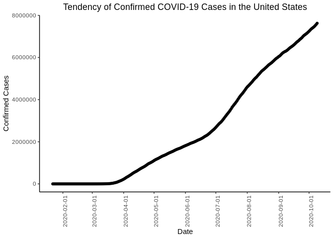
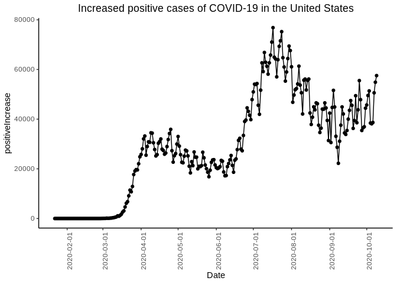
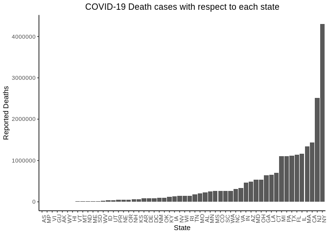
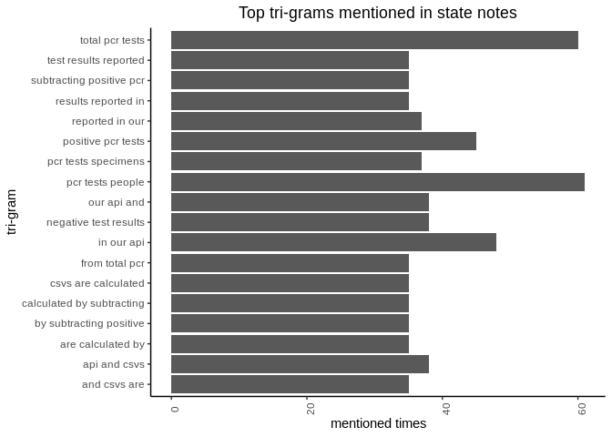

COVID-19 condition study in the United States
================
<liyongsh@usc.edu>

## Introduction

COVID-19 is a global pandemic that affects our health and life. By
exploring the COVID-19 condition, we can make take possible actions to
better contain its spread and make plans for the future. In this
project, we mainly study the COVID-19 condition in the United States.

How is the COVID-19 condition in the United States now? The question can
be answered from the following perspectives.

  - Q1: Condition Overview. Latest status about the accumulated
    confirmed case numbers,new confirmed cases,accumulated death,new
    deaths
  - Q2: Tendency. The tendency of COVID-19 infection.
  - Q3: Death Rate. The death cases in terms of each state.
  - Q4: Key Information. What is the key latest information we should
    pay attention to.

## Methods

The COVID Tracking Project is a volunteer organization to publish the
data required to understand the COVID-19 outbreak in the United States.
The website provides APIs for accessing the data:
<https://covidtracking.com/data/api>.

The data used for this project is as follows:

  - <https://api.covidtracking.com/v1/us/daily.csv>: Historical Data of
    COVID-19 in the United states.
  - <https://api.covidtracking.com/v1/states/info.csv>: Basic
    information about states, including notes about our methodology and
    the websites we use to check for data.
  - <https://api.covidtracking.com/v1/states/daily.csv>: all COVID data
    available for every state since tracking started.

This project uses the following packages to achieve the analysis:

  - data.table: read in web link data and converting to data.tables.
  - tidytext: extract ngrams from a text sequence.
  - ggplot2: produce the graphs.
  - knitr: knitr the document and produce nice-look markdown tables
  - tidyverse: data cleaning, filtering and so on.
  - head(), str() and so on are used for basic data explorations.

The data link can be directly read into a data.table using
`data.table::fread`

## Preliminary Results

### Q1: Condition Overview

Here is the summary of the latest status about the accumulated confirmed
case numbers,new confirmed cases,accumulated death,new
deaths

|     date | accumulated confirmed case numbers | new confirmed cases | accumulated death | new deaths |
| -------: | ---------------------------------: | ------------------: | ----------------: | ---------: |
| 20201009 |                            7623648 |               57542 |            205470 |        904 |

### Q2: Tendency.

The tendency of COVID-19 can reflect how will this pandemic will proceed
into the future. Is it getting better or worse?

<!-- -->

The line graph depicts the tendency of the COVID-19 pandemic. We can see
that there are more and more people getting infected with COVID-19. The
curve does not seem to be more flat as the time goes. Therefore, we have
not reached the turning point in which the actual condition gets better.

<!-- -->

From the curve of the Increased positive cases, we can see the new
confirmed cases recently are significantly less than before, plausibly
indicating that COVID-19 virus is leaving. However, this may subject to
many factors’ influences like testing capacities.

### Q3: Death Rate

There are some NAs in this dataset for variable `death`. we can remove
it using `dlpy::filter` function. The basic summary of death variable is
as follows:

| Min. | 1st Qu. | Median |     Mean | 3rd Qu. |  Max. | NA’s |
| ---: | ------: | -----: | -------: | ------: | ----: | ---: |
|    0 |      58 |    468 | 2027.509 |    1983 | 25561 |  752 |

<!-- -->

Death number is a good indicator to show the COVID-19 status in a state.
We can see from the bar graph that New York State is the most severe
state with regard to death cases. Still then, there are some states
showing a very low death number such as AS, MP,GU, VI and so on.

### Q4: Key Information

The COVID Tracking Project also gathers notes from every state. These
notes are informative for us to know about what is happing with the
COVID-19 status with the state. In other words, we can catch the latest
and most important information reading these notes. Simple text-mining
like n-grams can give us a rough topic about the pandemic condition.
Here, we choose tri-grams.

<!-- -->

From the statistics of tri-grams, we can infer that “PCR test” is the
most important information across all states. It means that most states
is mainly focusing on COVID-19 testing now.

## Summary

Based on the preliminary results we analyzed above, we can reach the
following conclusions.

How is the COVID-19 condition in the United States now?

The COVID-19 condition is not optimistic now, with the confirmed cases
still continuously growing. The death numbers are sharply different
across different states. In addition, most states are mainly working on
doing COVID-19 testing now.
